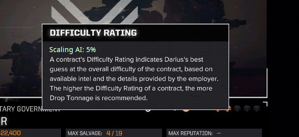

Scaling AI Difficulty (SAD) is a mod for HBS's Battletech computer game. It is a small, focused mod with a single purpose - applying stat effects to the AI and friendly units based on how "well" the player is doing. The mod's homepage is https://github.com/BlueWinds/ScalingAIDifficulty, where you can always find the most up to date source code.

SAD is distributed under the GNU General Public License v3.0 license. Special permission is granted to Battletech Advanced: 3062 and Roguetech to distribute this alongside Custom Bundle and other proprietary code. Please reach out to BlueWinds on github, or the BTA/RogueTech discords for more details.

## SAD_points
Each career has "SAD_points", representing the size of bonuses SAD will apply to enemy units. 0 has no effect, and larger numbers make the game harder. A player's total SAD_points can go negative, if they are struggling.

These are stored in the `SAD_points` company statistic, and so could theoretically be read or altered by events, as any other company stat. They are visible to the player by hovering over the contract difficulty rating.



### Points change each mission.
A player's SAD_points increase or decrease at the conclusion of each mission, based on how things went. Winning will increase their SAD_points, making future missions harder. Suffering losses will decrease their SAD_points, making future missions easier. This is capped by `minPoints` and `maxPoints` - a player's SAD_points will never move beyond these limits.

When a mission concludes, SAD looks at the `points` setting in `settings.json` and finds the **smallest** value that applies.
 - `victory`: Applies if the player won the mission.
 - `retreat`: Applies if the player withdrew (good or bad faith) or was defeated.
 - `defeat`: Applies if the player withdrew (good or bad faith) or was defeated.
 - `injury`: Applies if at least one player pilot took an injury that will leave them in medbay (eg, was not soaked with guts or by special equipment).
 - `mechDestroyed`: Applies if at least one player mech was destroyed (even if that unit is recoverable).
 - `vehicleDestroyed`: Applies if at least one player vehicle was destroyed (even if that unit is recoverable). Will have no effect unless you're using CustomBundle to allow player-controlled vehicles.
 - `baDestroyed`: Applies if at least one player battle armor squad was destroyed (even if that unit is recoverable). Will have no effect unless you're using CustomBundle to allow player-controlled vehicles.
 - `pilotDeath`: Applies if at least one player pilot was KIA.

For example, if a player wins, has an injury and loses a unit, SAD will search those three modifiers for the lowest one (most negative) and apply it.

### Difficulty Settings
`ArgoMechTechs` and `ArgoMedTechs` are vanilla simgameconstants which, in the base game, have no meaning. They are repurposed by SAD. When a player begins their career, their `SAD_points` are set to equal `ArgoMedTechs`. This lets mod authors create a difficulty setting that controls the initial value.

Changes to a player's SAD_points are multiplied by `ArgoMechTechs / 100`. For example, if the value is 50, then a player's SAD_points will rise or fall half as quickly. A value of 0 (which all saves have unless it's changed) means that SAD will have no effect (because the player's SAD_points will never change). **You must use a Difficulty Setting (or other method) to set `ArgoMechTechs` and/or `ArgoMedTechs` to a non-0 value if you want SAD to have any effect at all.**

See the examples in src/data/CareerDifficultySettings.json.

### Effects
Whenever an enemy unit spawns (be it start of mission, reenforcements, or any other time), SAD applies each entry in `EnemyEffectsPerPoint` effect to it. Similarly, `SelfEffectsPerPoint` is applied to the player's units.

The effects in each of these are applied once for each of the player's SAD_points. For example, if `EnemyEffectsPerPoint` is
```
[
  {
    "statName": "DamageReductionMultiplierAll",
    "operation": "Float_Multiply",
    "modValue": 0.99
  },
  {
    "statName": "ToHitThisActor",
    "operation": "Float_Add",
    "modValue": 0.01
  }
]
```

and the player has 3 SAD_points, all enemy units will get (0.99 * 0.99 * 0.99) = ~3% damage reduction and (0.1 + 0.1 + 0.1) = 0.3 difficulty to hit. Though they may look similar, these are not statistic effects - you cannot set targeting data, duration, description, etc, and the `modValue` is a number and not a string. The only valid `operation`s are `Float_Add` (you can use negative numbers, though) and `Float_Multiply`.

## Contract-Specific Settings

Contracts listed in `IgnoreContracts` are ignored. No effects are applied during the contract, and the results do not modify the player's SAD_points.

Contracts in `ContractDifficulty` have the listed value added to the player's own SAD_points to determine what effects to apply. For example, if the player has 3.5 points, and the contract is listed as -10, then the final value for this contract will be -6.5.
